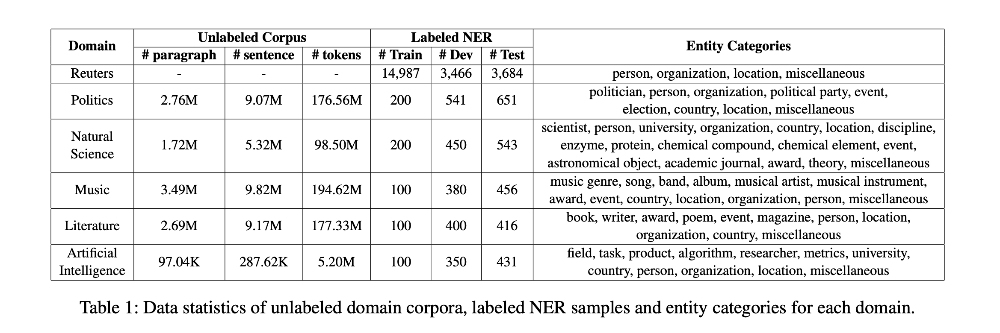

П# Описание датасета CrossNER

**Источник:** [Статья (PDF)](https://arxiv.org/pdf/2012.04373)

Датасет **CrossNER** разработан для оценки и изучения способности моделей распознавания именованных сущностей (NER) к обобщению между различными доменами. Он содержит данные из шести областей (доменных подсекций), извлечённые из английской Википедии, а также включает классический набор данных CoNLL2003:

- **AI**: Данные о темах, связанных с искусственным интеллектом.
- **Literature**: Тексты о литературных произведениях, писателях, жанрах.
- **Music**: Материалы о музыке, исполнителях, композициях, жанрах.
- **Politics**: Информация о политиках, политических событиях, партиях.
- **Science**: Данные о научных концептах, учёных, открытиях.
- **CoNLL2003**: Классический эталонный датасет для NER для сравнения.

Каждая доменная подсекция содержит свои специфические типы именованных сущностей, что позволяет оценить способность моделей обобщать знания, полученные в одном домене, на другие.

Структура и особенности датасета:
- Доступны три сплита для каждой доменной подсекции: `train`, `validation`, `test`.
- Набор сущностей и их распределение сильно варьируются от домена к домену.
- Датасет был создан для исследования междоменного переноса и устойчивости NER-моделей. В частности: CoNLL2003 рассматривался как source dataset, a остальные 5 доменов, как target dataset.

Применение:
- Оценка качества и устойчивости моделей NER при переходе между доменами.
- Изучение влияния доменных различий на результаты распознавания сущностей.
- Разработка более универсальных и обобщающих NER-моделей, способных работать в условиях значительных доменных сдвигов.

# Работа только с AI доменом

**Выводы: **

Таким образом, с точки зрения метрик нам удалось с помощью нейронных подходов сильно повысить метрики F1, precision, recall, не уронив уровня точности. Нейронные алгоритмы гораздо более удобны, когда нам надо добавить свои теги, они дают большую точность и позволяют легко добавлять новые теги - rule-based подход здесь был тотальным мучением!

Основная проблема, которую мы пытались пофиксить - сильная любовь к О.

Основной анализ методов проводился на ai домене, потому что его достаточно было для анализа (он и так получился большим)

Лучшим методом оказалась 2слойная LSTM бидирекционная с батч нормализацией, где мы привели наш текст к ловеркейсу и снизили процент рандомного инициализируемых эмбеддингов, которые мы потом учили. Тут можно делать бесконечно много всяких деталей, но две недели для супер фундаментального анализа не хватит даже если не работать)))) 
